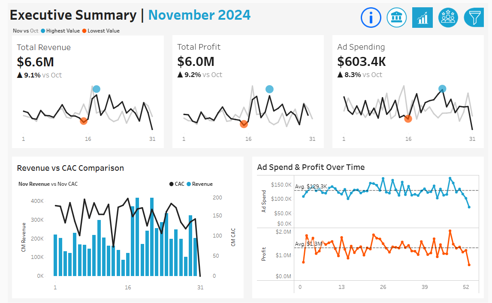

# 2024 Marketing Ad Campaign Performance

# Project Background
As a data analyst at an up-and-coming start-up, I have been tasked with visualizing nearly 2,000 ad campaigns to evaluate their effectiveness and efficiency month over month. **This report analyzes synthetic campaigns launched in 2024, providing insights into regional performance, ad spending trends, and key marketing metrics**. The goal is to uncover data-driven patterns that highlight growth opportunities, optimize resource allocation, and support strategic decision-making across different channels and audiences.

# Executive Summary
- Total revenue: **$76.5M**, with **$69.7M** in profit (91% profit margin).
- Average CTR: **11.4%**, which is **well above industry benchmarks (1–5%)**, suggesting either exceptional engagement or possible data anomalies requiring further validation.
- The **Seasonal Promo** campaign drove **21% of total revenue alone**, highlighting its effectiveness.
- A **13:1 ROAS** indicates highly optimized spending—$13 in revenue for every $1 invested.
- **Mobile users** had higher CTRs but lower conversion rates, pointing to UX issues in the mobile funnel.
- The **25–34 age group** and regions like **Australia and Europe** outperformed other segments in both engagement and conversion.

# Insights Deep-Dive
 - Overall Summary
   - Total revenue generated clocked in at around **$76.5M**, while total profit clocked in at around **$69.7M**.
   - April and September generated the least amount of revenue and were the least profitable months, suggesting slight increases in budget allocation to top performing months, such as June and January. Such disparity between months could indicate areas of seasonality, and opportunities to understand why these months are polar opposites.

 - Campaign Performance
   - The Seasonal Promo campaign was the top performer, bringing in **$16.3M** in revenue(21% of total revenue) and **$14.8M** in profit(21% of total profit).
   - Lead Generation was inconsistent with click-through-rates compared to the other campaigns. This campaign recorded 5 months with a below 10% CTR, 3 more than all others **combined**, but surprisingly is the campaign with the highest single-month rate, with a 13.7% CTR in June.
   - **Return on Ad Spend** is around 13:1, meaning for every dollar spent on ads, the company generates $13 in revenue. This suggests highly optimized campaigns—possibly due to precise audience targeting, compelling creatives, or cost-effective ad placements.
  
 - Audience Engagement
   - The 25–34 age group exhibits the highest click-through and conversion rates, suggesting this demographic resonates most with current ad creatives.
   - Regions like Australia and Europe show significantly higher engagement rates, likely due to better audience relevance or optimized ad placements.
   - Campaigns accessed via mobile devices have higher click-through rates but slightly lower conversion rates compared to desktop.

# Recommendations
- **Personalize Content For Returning Customers**: Implement loyalty programs or exclusive offers to encourage repeat purchases. Use retargeting ads with personalized content.
- **Capitalize on High-Engagement Regions**: Regions like Australia show strong engagement. Increase investment in these regions. Localize content to match regional preferences for even better results.
- **Reallocate Budget to High-ROAS Campaigns**: All 5 campaigns are delivering strong returns. Increase ad spend for these campaigns while monitoring if performance remains consistent at scale.
- **Optimize for Mobile Users**: Mobile users have higher CTR but lower conversion rates, hinting at potential issues in the conversion process. Improve mobile landing page speed and user experience. Simplify mobile checkout processes.

# Key Stakeholder Questions
- What are the primary business goals you want this dashboard to support? (E.g., revenue growth, customer retention, campaign efficiency)
- Are there specific KPIs that matter most to you or the leadership team?
- What decisions do you expect to make based on the insights from this dashboard?
- Are the current KPIs (e.g., Profit, CTR, Conversion Rate) aligned with your priorities?
- Do you require additional metrics, such as Customer Lifetime Value (CLV) or Churn Rate?
- How do you define key metrics like “conversion” or “engagement” for consistency?

# Assumptions & Caveats
- The biggest caveat is that this is synthetic, fake data generated in Python. The synthetic dataset is structured to mimic realistic trends, but it may not capture the full complexity of actual consumer behavior or market fluctuations.
- The data does not account for external influences such as seasonality, economic shifts, competitor activity, or major marketing events, which can impact performance.
- Metrics like **Ad Spend** and **CAC(Customer Acquisition Cost)** are calculated based on available data, assuming no hidden costs (e.g., agency fees, production costs, or platform-specific fees).

  

